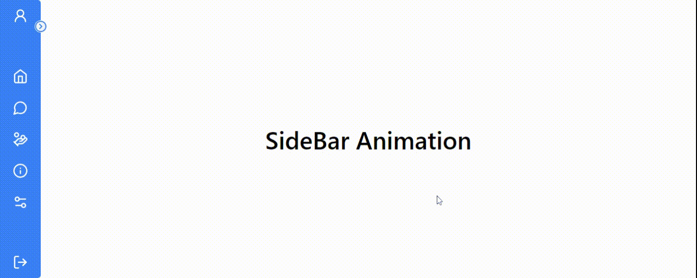
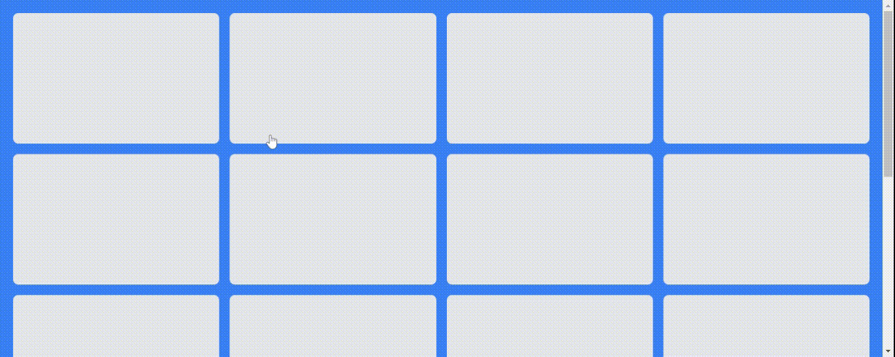

# Framer Motion Animation Components

🚀 Welcome to Animation Components! 🚀

This repository contains a collection of animated components built using React, Tailwind CSS, and Framer Motion. Each component comes with sleek animations to enhance your user interface.

### Features

✨ Modern UI Components: Elevate your user interface with stylish and interactive components.

🎨 Tailwind CSS Integration: Utilize the power of Tailwind CSS for easy customization and responsive design.

💫 Framer Motion Animations: Bring your components to life with smooth animations powered by Framer Motion.

🔍 Lucide Icons: Access a wide range of icons from Lucide Icons to enhance your components.

### Getting Started

Clone the repository: [git clone](https://github.com/srirakeshv/AnimationComponents.git)

Install dependencies: `npm install`

Start the development server: `npm start`

## Navigation Bar

## Side Bar

## DropDown Menu

## Cards

## Snack Bar

